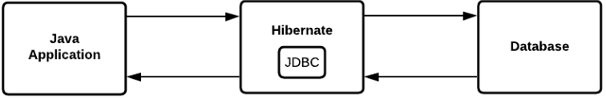
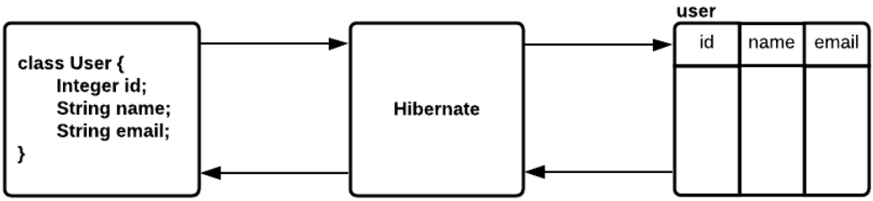
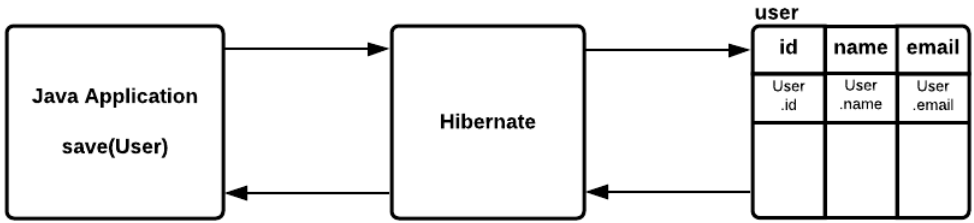
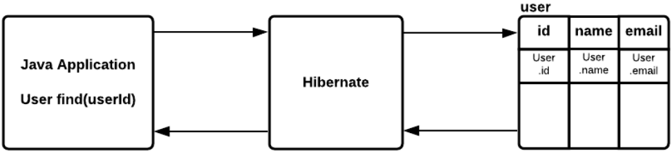
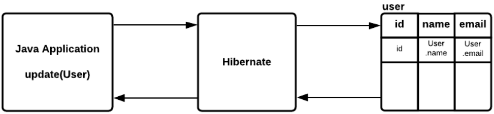
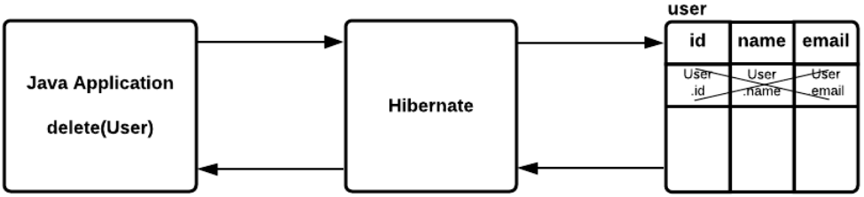
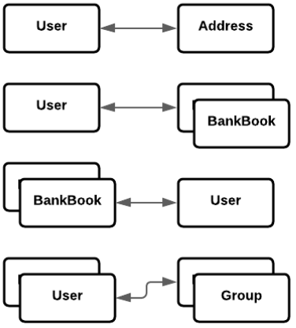
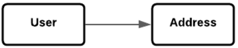
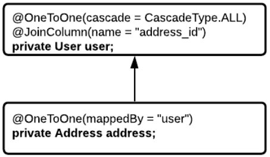
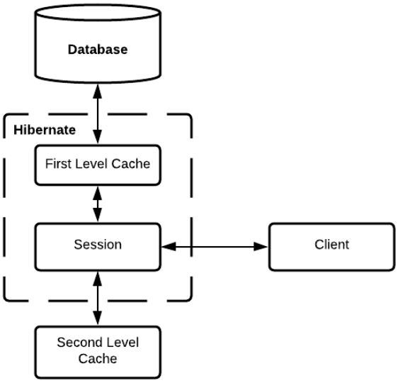

# Spring Data. JPA. Hibernate. Доступ к данным (БД)
До этого для хранения данных использовалась Map, хранение в оперативной памяти, этот способ не подходит при хранении 
больших информаций. Для это используется базы данных. В Spring Boot для этого есть `spring-boot-starter-data-jpa`.

Для подключения базы данных в Spring Boot приложении необходимо:
* Добавить зависимость `spring-boot-starter-data-jpa`
* Добавить JDBC драйвер для базы данных
* В application.properties указать url, user, password

## Spring Boot. JPA
**JPA (Java Persistence API)** - стандартная спецификация, описывающая систему для управления сохранением Java объектов 
в таблицы базы данных.

**Hibernate** - самая популярная реализация спецификации JPA. Таким образом JPA описывает правила, а Hibernate реализует их.

### JPA. Жизненный цикл Entity
У Entity существует 4 статуса жизненного цикла:
* **new** - объект создан, но при этом еще не имеет сгенерированных первичных ключей и пока еще не сохранен в базе данных;
* **managed** - объект создан, управляется JPA, имеет сгенерированные первичные ключи;
* **detached** - объект был создан, но не управляется (или больше не управляется) JPA;
* **removed** - объект был создан, управляется JPA, но будет удален после commit'а транзакции.

## Spring Boot. Подключение к БД

После подключения приложения к БД, в логах добавляется `com.zaxxer.hikari.HikariDataSource: HikariPool-1 - Starting...`.
**HikariPool** - Connection Pool до нашей БД. При обращении к БД если бы мы писали на JDBC, то каждый раз создавали бы
новое подключение и открывали новый connect, а HikariPool позволяет создать некий пул подключений, при необходимости
обращения к БД мы обращаемся сначала к Connection Pool получаем какой-то connection, используем его и возвращаем обратно
в пул.

Далее по логам видим что загружается Hibernate ORM `org.hibernate.Version: HHH000412: Hibernate ORM core version 5.6.9.Final`,
далее какой диалект используется `org.hibernate.dialect.Dialect: HHH000400: Using dialect: org.hibernate.dialect.PostgreSQL10Dialect`.

Property `spring.jpa.show-sql=true` позволяет видеть в логах какие sql-запросы генерирует Hibernate.

## Spring Boot. Hibernate
Hibernate - это framework, который используется для сохранения, получения, изменения и удаления Java объектов 
из базы данных.

Hibernate использует JDBC-драйвер для работы с базой данных. Но поверх этого реализован различный вспомогательный 
функционал:
* Реализует технологию ORM;
* Позволяет регулировать SQL запросы;
* Уменьшает количество кода для написания.



### Hibernate. ORM
ORM (Object-to-Relation Mapping) - преобразование Java-объектов в сущность таблицы в БД и обратно. Базово Hibernate 
предоставляет основные CRUD (create, read, update, delete) операции.



### Hibernate. Сохранение сущности
* Сбор данных для полей объекта;
* Написание INSERT команды для добавления новой строки в таблицу с собранными данными

```
INSERT INTO user(id, name, email)
VALUES (User.id, User.name, User.email)
```



### Hibernate. Получение сущности
* Написание SELECT команды для получения необходимых данных;
* Создание Java-объекта и присвоение его полям значений, полученных из БД;

```
SELECT id, name, email
FROM user
WHERE id = :user.id;
```



### Hibernate. Обновление сущности
* Сбор данных для полей объекта;
* Написание UPDATE команды для обновления необходимых данных;

```
UPDATE user
SET name = user.name, email = user.email
WHERE id = :user.id
```



### Hibernate. Удаление сущности
* Сбор данных для полей объекта;
* Написание UPDATE команды для удаления необходимых данных;

```
DELETE FROM user
WHERE id = :user.id
```



### Hibernate. Entity
**Entity** - это Java-класс, который отображает информацию определенной таблицы в базе данных. Точнее это POJO-класс, 
в котором мы используем определённые Hibernate аннотации для связи класса с таблицей из базы.

**@Entity** - аннотация, говорит нам о том, что класс имеет отображение в базе данных.

**@Table** - аннотация говорит нам, к какой именно таблицу привязан класс.

**@Column** - аннотация, говорит нам, к какому именно столбцу из таблицы привязано поле класса.

### Hibernate. Id

Для указания поля идентификатора (ключа) используется аннотация `@Id`.

Аннотация `@GenerateValue` описывает стратегию генерации значений для столбца с идентификатором.
* **AUTO** - дефолтный тип, бедут зависеть от БД;
* **IDENTITY** - автоматическое увеличение столбца по правилам, прописанным в БД;
* **SEQUENCE** - увеличение идентификатора с помощью sequence, описанного в БД.

### Hibernate. Типы отношений между объектами



* **OneToOne** - один к одному.
* **OneToMany** - один ко многим.
* **ManyToOne** - многие к одному.
* **ManyToMany** - многие ко многим.

**@JoinColumn** указывает на столбец, который осуществляет связь с другим объектом.

```@JoinColumn(name = "this_db_field", referencedColumnName = "remote_db_field")```

**Cascade операции** - это выполнение операции не только для Entity, на котором выполняется операция, но и связанных с ним Entity.

```@OneToOne(cascade = {CascadeType.PERSIST, CascadeType.MERGE, CascadeType.REFRESH})```

Типы каскадных операций:
* **ALL** - распространяет все операции, включая операции, специфичные для гибернации, от родительского объекта к дочернему.
* **PERSIST** - Операция сохранения делает временный экземпляр постоянным. Каскадный тип PERSIST распространяет операцию 
сохранения от родительского объекта к дочернему. Когда мы сохраняем объект UserEntity, объект Address также будет сохранен.
* **MERGE** - Операция слияния копирует состояние данного объекта в постоянный объект с тем же идентификатором. 
Каскадный тип MERGE распространяет операцию слияния от родительского объекта к дочернему.
* **REMOVE** - распространяет операцию удаления от родительского объекта к дочернему.
* **REFRESH** - дочерняя сущность также перезагружается из базы данных всякий раз, когда обновляется родительская сущность.
* **DETACH** - Операция отсоединения удаляет объект из постоянного контекста. Когда мы используем 
CascadeType.DETACH дочерний объект также будет удален из постоянного контекста.

#### Hibernate. Uni-directional

**Uni-directional** - отношение, владельцем которого является только одна из двух сторон. При этом вторая сторона 
об этом отношении ничего не знает. Hibernate будет считать владельцем отношения ту сущность, в которой будет поставлена
аннотация отношения

```java
class User {
    Address address;
}

class Address {
    
}
```



#### Hibernate. Bi-directional

**Bi-directional** - отношение, когда обе стороны знают друг о друге. У двусторонних отношений помимо стороны владельца 
(owning side) имеется еще и противоположная сторона (inverse side). Т.е. обе стороны отношения обладают информацией о 
связи. Логично предположить, что из одностороннего отношения можно сделать двустороннее просто добавив поле и аннотацию
в класс сущности противоположной стороны.

```java
class User {
    Address address;
}

class Address {
    User user;
}
```


В Bi-directional отношениях с помощью аннотации `@OneToOne` и `mapperBy` мы указываем Hibernate, где нужно искать связь 
между классами.



#### Hibernate. Типы загрузки данных

* **Eager** (нетерпеливая) - при ее использовании связанные сущности загружаются вместе с загрузкой основно сущности.
* **Lazy** (ленивая) - при ее использовании связанные сущности загружаются только при первом обращении к ним.

**Важно**: если связанная сущность попадет в toString(), то она будет загружена сразу!

В большинстве случаев при большом количестве связанных сущностей целесообразнее использовать Lazy загрузку, т.к.:
* Lazy загрузка имеет лучший performance по сравнению с Eager загрузкой;
* Иногда при загрузке основной сущности нам не нужны связанные с ней сущности. Поэтому их загрузка - лишняя работа.

Типы загрузки по-умолчанию:
* One-To-One - Eager
* One-To-Many - Lazy
* Many-To-One - Eager
* Many-To-Many - Lazy

#### Hibernate. JoinTable

JoinTable - вспомогательная таблица для связи Many-To-Many, которая отображает связь между строками 2-х других таблиц.
Столбцы JoinTable - это ForeignKey, которые ссылаются на PrimaryKey связываемых таблиц.

В аннотации JoinTable:
* Прописываем название таблицы, которая выполняет роль JoinTable;
* В JoinColumns указываем столбец таблицы JoinTable, который ссылается на PrimaryKey source-таблицы;
* В inverseColumns указываем столбец таблицы JoinTable, который ссылается на PrimaryKey target-таблицы.

### Hibernate. Lock
Что если 2-й потом начнет переводить деньги этому же пользователю - 1 из переводов затрется. Т.к. мы зависим от БД то все 
блокировки стоит производить на ней. Самый простой способ - повесить на метод получения записи в репозитории аннотацию 
**@Lock**, которая позволяет указать блокировку для нашей операции.

* **LockModeType.OPTIMISTIC** - оптимистичная блокировка на чтение: если при завершении транзакции кто-то извне изменит 
поле _@Version_, то транзакция автоматически будет откачена и будет выброшено _OptimisticLockException_.
* **LockModeType.OPTIMISTIC_FORCE_INCREMENT** - оптимистичная блокировка на запись. Ведёт себя, как и блокировка на чтение,
но при этом увеличивает значение поля _@Version_.
* **LockModeType.PESSIMISTIC_READ** - данные блокируются в момент чтения и это гарантирует, что никто в ходе выполнения 
транзакции не сможет их изменить. Остальные транзакции, тем не менее, смогут параллельно читать эти данные. Использование 
этой блокировки может вызывать долгое ожидание блокировки или даже выкидывание _OptimisticLockException_ (например если
установлен таймаут ожидания блокировки).
* **LockModeType.PESSIMISTIC_WRITE** - данные блокируются в момент записи и никто с момента захвата блокировки не может 
в них писать и не может их читать до окончания транзакции, владеющей блокировкой. Использование этой блокировки может 
вызывать долгое ожидание блокировки.
* **LockModeType.PESSIMISTIC_FORCE_INCREMENT** - ведет себя как _LockModeType.PESSIMISTIC_READ_, но в конце транзакции
увеличивает значение поля _@Version_, даже если фактически сущность не изменилась.

Что такое **@Version**? Это обычное поле в БД, которое показывает версию сущности, при изменении сущности - автоматически 
увеличивает его на 1.

### Hibernate. Кэширование
Hibernate cache - это 3 уровня кэширования своих результатов:
* Кэш первого уровня (First-level cache);
* Кэш второго уровня (Second-level cache);
* Кэш запросов (Query cache).



#### Hibernate. Кэш первого уровня
**Кэш первого уровня** - это кэш сессии (Session), который является обязательным. Через него проходят все запросы. Перед тем,
как отправить объект в БД, сессия хранит объект за счет своих ресурсов.

Отключить данный кэш нельзя!

Как он работает:
1. Перед тем, как запрашивать в БД какое значение Hibernate сначала проверяет наличие в кэше, если оно там имеется, то он 
его возвращает. Если его там нет, то идет запрос в БД и добавление в кэш.
2. Перед обновлением сущностей Hibernate также обновляет сначала значение в кэше первого уровня.

#### Hibernate. Кэш второго уровня
Если кэш первого уровня привязан к объекту сессии, то кэш второго уровня привязан к объекту-фабрике сессий (_Session 
Factory object_). Что как бы подразумевает, что видимость этого кэша гораздо шире кэша первого уровня.

Кэш второго уровня является необязательным (опциональным) и изначально _Hibernate_ будет искать необходимый объект в кэше 
первого уровня.

В основном кэширование второго уровня отвечает за кэширование объектов.

Популярная реализация **EHCache**.

Включается с помощью аннотации **@org.hibernate.annotation.Cache()** на самих _Entity_.

Если включен кэш второго уровня:
1. Перед тем, как запрашивать в БД какое значение Hibernate сначала проверяет наличие в кэше первого уровня, если оно 
там имеется, то он его возвращает. Если его там нет, то проверяет наличие в кэше первого уровня, если оно там имеется, 
то он его возвращает, в противном случае идет запрос в БД и добавление в кэши обоих уровней.
2. Перед обновлением сущностей Hibernate также обновляет сначала значение в кэше обоих уровней.

Стратегии кэширования определяют поведение кэша в определённых ситуациях. Выделяют четыре группы:
* **Read-only** - полезно для данных, которые часто читаются, но никогда не обновляются;
* **Read-write** - используется в случае, когда наши данные необходимо обновлять;
* **Nonstrict-read-write** - используется, если приложение редко обновляет данные;
* **Transactional** - используется для данных, которые в большинстве случаев читаются и также где является критичным 
предотвращение протухания данных в конкурирующих транзакциях.

#### Hibernate. Кэш запросов
В Hibernate предусмотрен кэш для запросов и он интегрирован с кэшем второго уровня. Это требует двух дополнительных 
физических мест для хранения кэшированных запросов и временных меток для обновления таблицы БД. Этот вид кэширования 
эффективен только для часто используемых запросов с одинаковыми параметрами.

Работает для методов аннотированных **@Query**.

Необходимо добавить аннотацию `@QueryHints(@QueryHint(name = HINT_CACHEABLE, value = "true"))`

## Миграции. Liquibase
**Liquibase** - независимая от базы данных библиотека для отслеживания, управления и применения изменений схемы базы данных.
Кроссплатформенное Java приложение, дополнительная библиотека в Spring Boot.

Изменения для БД записываются в формате понятном Liquibase, а уже он в свою очередь выполняет запросы к базе данных.
Таким образом реализуется независимость от конкретной БД.

### Liquibase. Changelog

Изменения структуры базы данных записываются в файлы, которые называются **ChangeLog**. 
Поддерживаемые форматы: XML, YAML, JSON или SQL.

Файлы изменений могут быть произвольно включены друг в друга для лучшего управления.

Единицей в Changelog является **ChangeSet** - аналог коммита в системах контроля версий, таких как Git. ChangeSet может 
содержать одно или несколько изменений БД. Хорошей практикой считается 1 команда для 1 ChangeSet.

Каждый ChangeSet имеет составной идентификатор id, author и filename, который должен быть уникальным.

### Liquibase. Блокировка

При первом запуске Liquibase создает 2 технические таблицы:
* **databasechangelog** - содержит список изменений схемы БД. Туда записываются уже выполненные ChangeSet.
* **databasechengelock** - используется для блокировки на время работы, чтобы гарантировать одновременную работу только 
1 экземпляра Liquibase.

После выполнения changeSet в таблицу _databasechangelog_ со всем прочим записываются MD5 хэш changeSet. Хэш высчитывается 
на основе нормализованного содержимого XML. При следующем запуске Liquibase будет сверять вновь рассчитанные хэш суммы 
со значениями в его таблице. Если вы изменили уже выполненные changeSet, то хэш сумма будет отличаться, и приложение 
упадет с ошибкой при старте.

**После выполнения changeSet нельзя просто изменить!** В этом случае есть 3 пути:
* Создать новый _changeSet_ с изменениями **[Рекомендуемый]**
* Выполнить откат средствами Liquibase
* Удалить запись о выполнении _changeSet_ из _databasechangelog_. **Не рекомендуется**, если changeSet уже выполнен на 
каком-то контуре. Этот вариант удобен при локальной разработке.

Если несколько экземпляров Liquibase будут выполняться одновременно с одной и той же БД, вы получите конфликты. 
Это может произойти, если несколько разработчиков используют один и тот же экземпляр БД или в кластере несколько 
серверов, которые автоматически запускают Liquibase при запуске.

Для защиты от таких ситуаций Liquibase создает таблицу **databasechengelock**, в которой есть _boolean_ поле _locked_. 
При запуске Liquibase проверяет его состояние, и если оно _true_, то ожидает смены на _false_.


### Liquibase. Настройка в Spring Boot
Чтобы добавить поддержку Liquibase, нужно указать следующую зависимость в maven:
```xml
<dependency>
    <groupId>org.liquibase</groupId>
    <artifactId>liquibase-core</artifactId>
</dependency>
```

Создаем файл `resouces/db/changelog/db.changelog-master.xml`. И изменяем путь в _application.yml_:
```yaml
spring:
  liquibase:
    change-log: classpath*:db/changelog/db.changelog-master.xml
```

Пример _db.changelog-master.xml_:
```xml
<databaseChangeLog
        xmlns:xsi="http://www.w3.org/2001/XMLSchema-instance"
        xmlns="http://www.liquibase.org/xml/ns/dbchangelog"
        xsi:schemaLocation="http://www.liquibase.org/xml/ns/dbchangelog
        http://www.liquibase.org/xml/ns/dbchangelog/dbchangelog-3.1.xsd">

    <includeAll path="db/changelog/init"/>
    
    <include file="db/changelog/v1/changeset-v1.0.xml"/>
    
    <!-- Пример создания таблицы -->
    <changeSet id="create-ad-address-table" author="iteco">
        <createTable tableName="address" schemaName="ad">
            <column name="id" type="serial">
                <constraints primaryKey="true"/>
            </column>
            <column name="country" type="varchar"/>
            <column name="city" type="varchar"/>
            <column name="street" type="varchar"/>
            <column name="home" type="varchar"/>
        </createTable>
    </changeSet>
    
</databaseChangeLog>
```

## Spring Boot. Логирование
Фреймворк Spring Boot предварительно настроен с использованием Logback в качестве реализации по-умолчанию в его 
"компетентном" подходе к Spring Framework.

Дефолтный вид лога:
```text
  .   ____          _            __ _ _
 /\\ / ___'_ __ _ _(_)_ __  __ _ \ \ \ \
( ( )\___ | '_ | '_| | '_ \/ _` | \ \ \ \
 \\/  ___)| |_)| | | | | || (_| |  ) ) ) )
  '  |____| .__|_| |_|_| |_\__, | / / / /
 =========|_|==============|___/=/_/_/_/
 :: Spring Boot ::                (v2.7.2)

2022-07-30 19:36:05.359  INFO 10524 --- [           main] r.i.t.s.SpringJuniorApplication          : Starting 
SpringJuniorApplication using Java 11.0.12 on General-pc with PID 10524 
```

Уровни логирования (в порядке их ранжирования): **FATAL**, **ERROR**, **WARN**, **INFO**, **DEBUG**, **TRACE**, **ALL**

Spring Boot предлагает значительную поддержку для настройки ведения журнала в соответствии с нашими требованиями к 
ведению журнала. На высоком уровне мы можем изменить параметры командной строки или добавить свойства в application.yml, 
чтобы настроить некоторые функции ведения журнала.

```properties
logging.level.org.springframework=ERROR
logging.level.io.app=TRACE
```

Можно записывать наши журналы в файл, установив только одно из свойств `logging.file.name` или `logging.file.path` в нашем 
_application.yml_. По-умолчанию для вывода в файл установлен уровень журнала info.

Помимо имени файла, можно переопределить шаблон ведения журнала по-умолчанию с помощью свойства `logging.pattern.file`:

```properties
logging.pattern.file='%d{yyyy-MM-dd HH:mm:ss} [%thread] %-5level %logger{52} - %msg%n'
```

Когда логи пишем в файл, то надо его как-то ограничить.

| Свойство                            | Что это значит                                                                                                     | Значение<br/>по-умолчанию |
|-------------------------------------|--------------------------------------------------------------------------------------------------------------------|---------------------------|
| logging.file.max-size               | максимальный общий размер архива до ротации журнала                                                                | 10 Mb                     |
| logging.file.max-history            | сколько дней должны храниться файлы ротации журналов                                                               | 7 дней                    |
| logging.file.total-size-cap         | общий размер архивов журналов. Резервные копии удаляются, когда общий размер архивов журналов превышает этот порог | не указано                |
| logging.file.clean-history-on-start | принудительная очистка архива журнала при запуске приложения                                                       | false                     |

Также можно изолировать конфигурацию журнала из приложения, указав конфигурацию _logback.xml_ или _logback-spring.xml_ в XML 
или заводной синтаксиса. Spring рекомендует использовать _logback-spring.xml_ или _logback-spring.groovy_ потому что они 
более мощные. Данный файл будет иметь приоритет над указанными параметрами в _application.yml_.