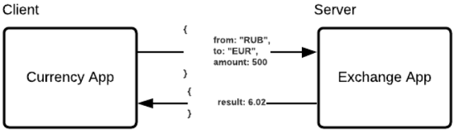

# Подключение REST Client
Класс RestTemplate является центральным классом в Spring Framework для синхронных вызовов (synchronous calls), сделанных 
с помощью Client для доступа к RESTful Web Service. Данный класс предоставляет функции для легкой работы с REST Services.
При использовании Rest Template, пользователь должен предоставить URL, параметры (если есть) и извлечь полученный 
результат. Rest Template контролирует соединение HTTP (HTTP Connection).




Чтобы получить доступ к RestTemplate необходимо его инициализировать, т.к. в дефолтном контексте его нет. Но есть 
RestTemplateBuilder, который позволяет настраивать RestTemplate перед созданием:

```
@Bean
public RestTemplate restTemplate(RestTemplateBuilder restTemplateBuilder) {
    return restTemplateBuilder.build();
}
```

```
public AnyObject latestByRub() {
    RequestEntity<Void> requestEntity = RequestEntity
        .get(url)
        .header("key", value)
        .build();
    ResponseEntity<AnyObject> responseEntity = restTemplateExchange.exchange(requestEntity, AnyObject.class);
    return responseEntity.getBody();
}
```