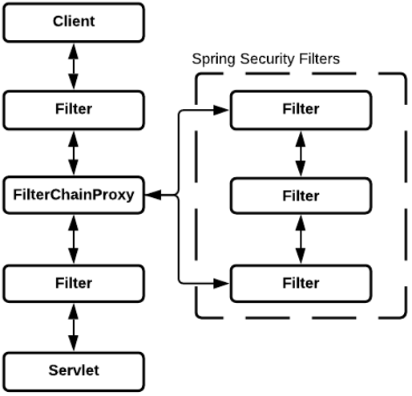
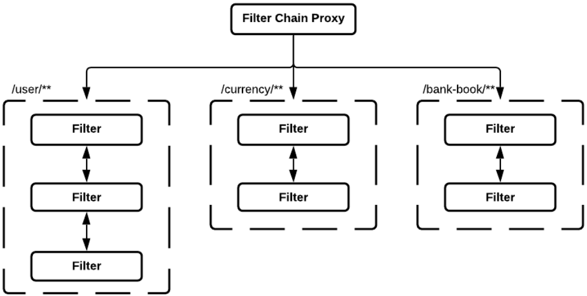
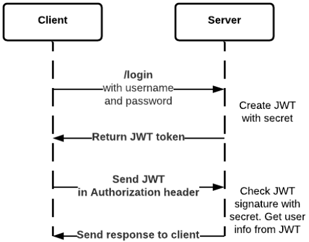
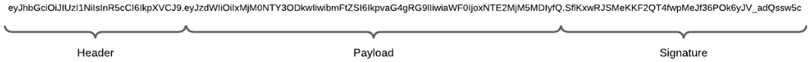
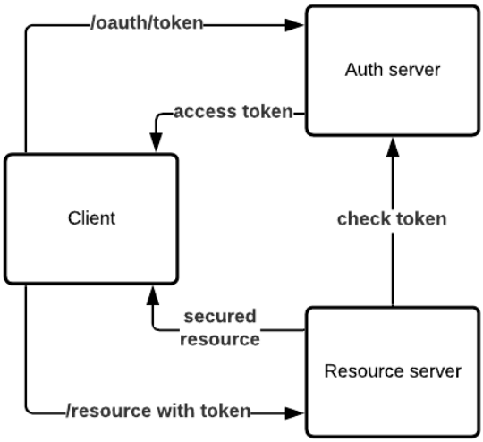

# Spring Boot. Security
## Spring Security. Аутентификация и авторизация
**Spring Security** - framework, предоставляющий механизмы построения систем аутентификации и авторизации, а также другие 
возможности обеспечения безопасности для корпоративных приложений, созданных с помощью Spring Framework.

**Аутентификация** - процесс проверки подлинности путём сравнения введенных имени пользователя и пароля с хранящимися в 
базе.

**Авторизация** - процесс проверки прав доступ к тому или иному ресурсу.



По сути Spring Security - прослойка между клиентом и сервлетом. Перед тем как наш запрос попадет в сервлет он проходит 
определённые фильтры. Один из фильтров FilterChainProxy и SpringSecurityFilter, в этих фильтрах происходят 
дополнительные проверки аутентификации и авторизации.

Проверяем:
1. Существует ли пользователь
2. Правильные ли ввел логин/пароль
3. Есть ли у пользователя доступ к запрашиваемой информации

Это делается с помощью SpringSecurityContextHolder, который хранит в себе всю информацию по пользователю и по
SecurityContext



Разделение идет по URL, у каждого могут быть свои фильтры.

## Spring Security. Подключение
Для того чтобы добавить Security в свой проект необходимо добавить зависимость:
```xml
<dependency>
    <groupId>org.springframework.boot</groupId>
    <artifactId>spring-boot-starter-security</artifactId>
</dependency>
```
Т.к. никакие фильтры не реализованы то все доступы станут заблокированы по-умолчанию. Необходимо реализовать 
UserDetailService и его метод:
```java
@Component
public class UserDetailServiceImpl implements UserDetailsService {
    @Override
    public UserDetails loadUserByUsername(String username) throws UsernameNotFoundException {
        // загрузка пользователя из хранилища
    }
}
```
Тут мы можем написать реализацию in-memory (создать in-memory хранилище, hashMap), загрузить пользователей из конфига, 
БД.

Далее настраиваем конфигурацию, расширяя класс WebSecurityConfigurerAdapter и его методы:
```java
@Configuration
public class SecurityConfiguration extends WebSecurityConfigurerAdapter {
    @Override
    protected void configure(AuthenticationManagerBuilder auth) throws Exception {
        super.configure(auth); // настройки действия Security
    }

    @Override
    protected void configure(HttpSecurity http) throws Exception {
        super.configure(http); // тут наш реализованный UserDetailService
    }
}
```

В новой версии Spring Boot ~~WebSecurityConfigurerAdapter~~ объявлен **deprecated**. Для конфигурирования нужно объявить бины:
```java
@Configuration
@EnableWebSecurity
public class SecurityConfig {
    @Bean
    public SecurityFilterChain filterChain(HttpSecurity httpSecurity) throws Exception {
        return httpSecurity.build();
    }

    @Bean
    public PasswordEncoder passwordEncoder() {
        return new BCryptPasswordEncoder();
    }

    @Bean
    public AuthenticationManager authenticationManager(AuthenticationConfiguration authenticationConfiguration) throws Exception {
        return authenticationConfiguration.getAuthenticationManager();
    }
}
```

Также можно на методы вешать аннотацию `@PreAuthorize("hasAnyAuthority(role1, role2)")`.

## Spring Security. JWT
**JSON Web Token (JWT)** - это открытый стандарт (RFC 7519) для создания токенов доступа, основанный на формате JSON.

Фактически это просто строка символов (закодированная и подписанная определёнными алгоритмами) с некоторой структурой,
содержащая полезные данные пользователя, например ID, имя, уровень доступа и так далее. И эта строчка передается клиентом 
приложению при каждом запросе, когда есть необходимость идентифицировать и понять кто прислал этот запрос.



У нас есть клиент и сервер. Клиент выполняет операцию _login_ передавая свои username и password. Сервер проверяет, есть ли 
этот пользователь в системе, если да то генерирует и возвращает клиенту JWT. При следующих запросах клиент отправляет 
данный токен вместо логина/пароля, и сервер проверяет валидность данного JWT.

JWT состоит из трёх частей, разделенных через точку:
* Заголовок (header). Содержит в себе определённую мета-информацию (по типу подписи, типу JWT...)
* Полезные данные (payload). Содержит в себе информацию о пользователе, идентификатор, жизненный цикл JWT...
* Подпись (signature)



**Заголовок** - первая часть токена. Она служит прежде всего для хранения информации о токене, которая должна рассказать 
о том, как нам прочитать дальнейшие данные, передаваемые JWT. Заголовок предоставлен в виде JSON объекта, закодированного 
в BASE64-URL. 
Например `eyJhbGciOiJIUzI1NiIsInR5cCI6IkpXVCJ9 = {"alg":"HS256","typ":"JWT"}`. 
Для работы с этим алгоритмом у нас 1 ключ, который хранится на сервере. Также существуют и асимметричные алгоритмы 
которые можно использовать в JWT, для работы с ними уже требуются 2 ключа (открытый и закрытый).

**Полезные данные** - вторая часть токена. Опять же - это JSON объект, который для удобства и безопасности передачи 
представляется строкой, закодированной в base64. Например 
`eyJ1c2VyX2lkIjoxLCJleHAiOjE1ODEzNTcwMzl9 = {"user_id":1,"exp":1581357039}`

**Подпись** - третья часть токена. Происходит следующее: наше приложение при прохождении пользователем процедуры 
подтверждения, что он тот за кого себя выдает, генерирует этот самый токен, определяет поля которые нужны, записывает 
туда данные которые характеризуют данного пользователя, а дальше с помощью заранее выбранного алгоритма (который 
отмечается в заголовке в поле alg токена), например HMAC-SHA256, и с помощью своего приватного ключа (или некой 
секретной фразы, которая находится только на серверах приложения) все данные токена подписываются. И затем сформированная 
подпись добавляется, также в формате base64, в конец токена.

`S9Z8uEGGTVVtLggFTizCsMtwOJnRhjaQ2BMUQhcY = HMACSHA256(base64UrlEncode(header) + "." +base64UrlEncode(payload),SECRET_KEY)`

## Spring Security. OAuth
OAuth2 - это протокол авторизации, который позволяет предоставить третьей стороне ограниченный доступ к защищенным 
ресурсам пользователя без необходимости передавать ей (третьей стороне) логин и пароль.

OAuth2 определяет 4 роли:
* Владелец ресурса
* Ресурсный сервер
* Сервер авторизации
* Клиент (приложение)

Наше приложение запрашивает у владельца ресурса авторизацию на доступ к серверу ресурсов, т.е. владелец ресурса 
определяет к кого доступ есть, а у кого нет. Если владелец ресурса авторизует наш запрос, то приложение получает 
разрешение на авторизацию, далее приложение запрашивает авторизационный токен у сервера авторизации путем представления 
информации о себе. Если подлинность клиента подтверждена, то сервер авторизации создает токен пользователя для приложения
и процесс авторизации считается завершенным. С этим токеном мы можем обращаться к ресурсному серверу который будет 
проверять наш токен с помощью сервера авторизации.



Владелец ресурса выдает какие-то параметры с которыми мы будем обращаться к серверу авторизации и мы их передаем с path 
`/oauth/token` (образно). Из обязательных параметров передаем _grant_type_, _client_id_, _client_secret_, также 
AuthServer будет запрашивать _username_ и _password_ нашего клиента который имеется в AuthServer. Если имеется такой 
пользователь (username/password or client_id or client_secret), то получает ответ _Accept Token_ - токен с которым далее 
будем обращаться к нашему ресурсу. Далее направляемся в Resource Server с нашим токеном и получаем какие-то _secured resource_,
но перед этим Resource Server проверяет токен с которым было обращение в AuthServer. Если токен валиден, то отдает ресурсы
приложению, если нет - возвращает ошибку авторизации.

**client_id** - уникальные идентификаторы который используется для связи между клиентом и сервером авторизации. Его генерирует
сервер авторизации для каждого клиента и хранится на стороне клиента.

В случае с _Client Credentials_ и _Authorization Code_ мы храним **client_secret** - секрет который используется при обращении к 
Auth сервису.

grant_type - типы авторизации. OAuth2 поддерживает 4 типа авторизации:
* **Authorization Code** - код авторизации. Является одним из самых распространенных типов разрешения на авторизацию, т.к. он 
хорошо подходит для серверных приложений, где исходный код приложений (secret) недоступны посторонним (хранятся где-то 
на сервере и к этим данным нет доступа). Процесс строится на перенаправлении, т.е. на редиректах, это означает что 
приложение должно быть в состоянии взаимодействовать с пользовательским агентом (напр. Веб-браузер) и получать коды 
авторизации API, которое перенаправляется через пользовательский агент. Иначе говоря, у нас есть некий URL, мы на него 
переходим, он перенаправляет нас на какую-то другую страницу авторизации. После авторизации идет перенаправление на страницу 
клиента, подкладывая токен.
* **Implicit** - неявный. Часто используется мобильными или веб-приложении где мы не можем гарантировать конфиденциальность 
нашего client_secret. Основан на перенаправлении пользовательского клиента, только при этом токен доступа передается 
пользовательскому агенту для дальнейшей передачи приложению, но это делает токен доступным пользователям других приложений 
на устройстве пользователя. Т.е. когда мы работаем например через браузер или приложение мы не можем на стороне клиента 
как в случае с Authorized Code хранить client_secret потому что в теории к нему имеют доступ третьи лица и могут этот 
секрет переиспользовать дальше. Поэтому можем хранить только токен, который имеет жизненный цикл и получается 
при обращении к Auth Server.
* **Resource Owner Password Credentials** - пользователь предоставляет приложению напрямую свои авторизационные данные 
в сервисе (логин и пароль). Приложение в свою очередь использует учетные данные пользователя для получения токена доступа 
из сервиса. Т.е. передаем client_Id, client_secret, username, password приложению, а он уже передает их в Auth Server 
для получения токена. Используется в основном в том случае когда остальные типы недоступны, потому что мы передаем
логин, пароль, секрет. Стоит использовать в том случае когда приложение пользуется доверием пользователя, напр. является
частью самого сервиса пользователя. 
* **Client Credentials** - тип авторизации с использованием учетных данных клиента, который позволяет приложению 
осуществлять доступ к своему собственному аккаунту сервиса. Может быть полезно когда приложение хочет обновить собственную 
информацию на сервисе или URL по которому дальше перенаправляем нашего клиента. Передается только client_Id и client_secret.
Полученный токен передаем в _header_ `Authorization: Bearer access_token`