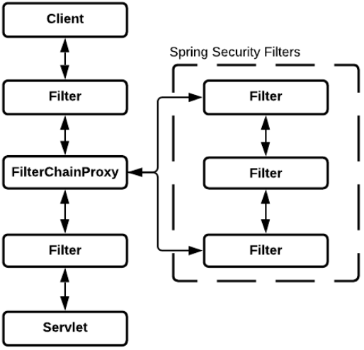
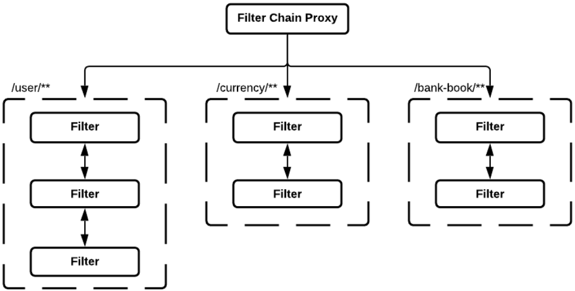

# Spring Security. Аутентификация и авторизация
**Spring Security** - framework, предоставляющий механизмы построения систем аутентификации и авторизации, а также другие 
возможности обеспечения безопасности для корпоративных приложений, созданных с помощью Spring Framework.

**Аутентификация** - процесс проверки подлинности путём сравнения введенных имени пользователя и пароля с хранящимися в 
базе.

**Авторизация** - процесс проверки прав доступ к тому или иному ресурсу.



По сути Spring Security - прослойка между клиентом и сервлетом. Перед тем как наш запрос попадет в сервлет он проходит 
определённые фильтры. Один из фильтров FilterChainProxy и SpringSecurityFilter, в этих фильтрах происходят 
дополнительные проверки аутентификации и авторизации.

Проверяем:
1. Существует ли пользователь
2. Правильные ли ввел логин/пароль
3. Есть ли у пользователя доступ к запрашиваемой информации

Это делается с помощью SpringSecurityContextHolder, который хранит в себе всю информацию по пользователю и по
SecurityContext



Разделение идет по URL, у каждого могут быть свои фильтры.

Для того чтобы добавить Security в свой проект необходимо добавить зависимость:
```xml
<dependency>
    <groupId>org.springframework.boot</groupId>
    <artifactId>spring-boot-starter-security</artifactId>
</dependency>
```
Т.к. никакие фильтры не реализованы то все доступы станут заблокированы по-умолчанию. Необходимо реализовать 
UserDetailService и его метод:
```java
@Component
public class UserDetailServiceImpl implements UserDetailsService {
    @Override
    public UserDetails loadUserByUsername(String username) throws UsernameNotFoundException {
        // загрузка пользователя из хранилища
    }
}
```
Тут мы можем написать реализацию in-memory (создать in-memory хранилище, hashMap), загрузить пользователей из конфига, 
БД.

Далее настраиваем конфигурацию, расширяя класс WebSecurityConfigurerAdapter и его методы:
```java
@Configuration
public class SecurityConfiguration extends WebSecurityConfigurerAdapter {
    @Override
    protected void configure(AuthenticationManagerBuilder auth) throws Exception {
        super.configure(auth); // настройки действия Security
    }

    @Override
    protected void configure(HttpSecurity http) throws Exception {
        super.configure(http); // тут наш реализованный UserDetailService
    }
}
```