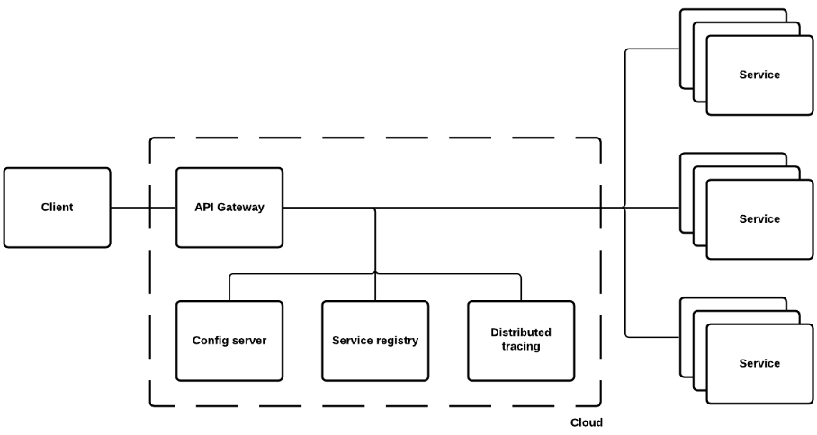

# Spring Cloud
**Spring Cloud** - это проект, который позволяет создавать распределенные приложения с микросервисной архитектурой.
Использование Spring Cloud упрощает подключение к сервисам, получение возможностей окружения в облачных платформах,
работу в несколькими инстансами приложения, чтоб 1 урл соответствовал нескольким инстансам.

Spring Cloud Gateway - просто и эффективный способ маршрутизации к API и предоставления им комплексных функций, таких как
безопасность, мониторинг/метрики и отказоустойчивость.

Возможности:
* Сопоставление route по любому атрибуту запроса;
* Предикаты и фильтры для route;
* Интеграция с Circuit Breaker;
* Интеграция Spring Cloud Discovery Client;
* Ограничение частоты запросов;
* Переписывание пути запроса.

route - path по которому обращаемся к gateway. 

## Spring Cloud. Service registry

В облаке приложения не всегда могут знать точное местоположение других служб. Сервисный реестр, например Eureka или 
вспомогательное решение, такое как Consul HashiCorp, может помочь. Spring Cloud предоставляет DiscoveryClient реализации 
для популярных реестров, таких как Eureka, Consul, Zookeeper, и даже Kubernetes. Также есть Spring Cloud Load Balances, 
чтобы помочь вам распределить нагрузку между экземплярами сервисов.