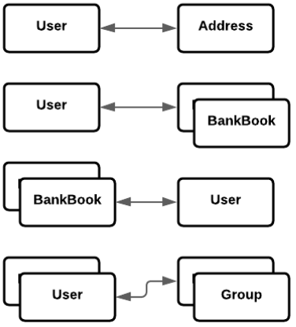
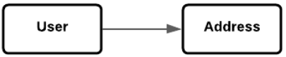
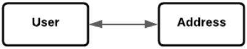
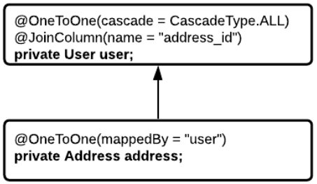

# Spring Data. JPA. Hibernate. Доступ к данным (БД)
До этого для хранения данных использовалась Map, хранение в оперативной памяти, этот способ не подходит при хранении 
больших информаций. Для это используется базы данных. В Spring Boot для этого есть spring-boot-starter-data-jpa.

Для подключения базы данных в Spring Boot приложении необходимо:
* Добавить зависимость spring-boot-starter-data-jpa
* Добавить JDBC драйвер для базы данных
* В application.properties указать url, user, password

## Spring Boot. JPA
JPA (Java Persistence API) - стандартная спецификация, описывающая систему для управления сохранением Java объектов 
в таблицы базы данных.

Hibernate - самая популярная реализация спецификации JPA. Таким образом JPA описывает правила, а Hibernate реализует их.

### Spring Boot. Подключение к БД

После подключения приложения к БД, в логах добавляется `com.zaxxer.hikari.HikariDataSource: HikariPool-1 - Starting...`.
**HikariPool** - Connection Pool до нашей БД. При обращении к БД если бы мы писали на JDBC, то каждый раз создавали бы
новое подключение и открывали новый connect, а HikariPool позволяет создать некий пул подключений, при необходимости
обращения к БД мы обращаемся сначала к Connection Pool получаем какой-то connection, используем его и возвращаем обратно
в пул.

Далее по логам видим что загружается Hibernate ORM `org.hibernate.Version: HHH000412: Hibernate ORM core version 5.6.9.Final`,
далее какой диалект используется `org.hibernate.dialect.Dialect: HHH000400: Using dialect: org.hibernate.dialect.PostgreSQL10Dialect`.

Property `spring.jpa.show-sql=true` позволяет видеть в логах какие sql-запросы генерирует Hibernate.

## Spring Boot. Hibernate
Hibernate - это framework, который используется для сохранения, получения, изменения и удаления Java объектов 
из базы данных.

Hibernate использует JDBC-драйвер для работы с базой данных. Но поверх этого реализован различный вспомогательный 
функционал:
* Реализует технологию ORM;
* Позволяет регулировать SQL запросы;
* Уменьшает количество кода для написания.


### Hibernate. ORM
ORM (Object-to-Relation Mapping) - преобразование Java-объектов в сущность таблицы в БД и обратно. Базово Hibernate 
предоставляет основные CRUD (create, read, update, delete) операции.


### Hibernate. Сохранение сущности
* Сбор данных для полей объекта;
* Написание INSERT команды для добавления новой строки в таблицу с собранными данными

```
INSERT INTO user(id, name, email)
VALUES (User.id, User.name, User.email)
```


### Hibernate. Получение сущности
* Написание SELECT команды для получения необходимых данных;
* Создание Java-объекта и присвоение его полям значений, полученных из БД;

```
SELECT id, name, email
FROM user
WHERE id = :user.id;
```


### Hibernate. Обновление сущности
* Сбор данных для полей объекта;
* Написание UPDATE команды для обновления необходимых данных;

```
UPDATE user
SET name = user.name, email = user.email
WHERE id = :user.id
```


### Hibernate. Удаление сущности
* Сбор данных для полей объекта;
* Написание UPDATE команды для удаления необходимых данных;

```
DELETE FROM user
WHERE id = :user.id
```


### Hibernate. Entity
**Entity** - это Java-класс, который отображает информацию определенной таблицы в базе данных. Точнее это POJO-класс, 
в котором мы используем определённые Hibernate аннотации для связи класса с таблицей из базы.

**@Entity** - аннотация, говорит нам о том, что класс имеет отображение в базе данных.

**@Table** - аннотация говорит нам, к какой именно таблицу привязан класс.

**@Column** - аннотация, говорит нам, к какому именно столбцу из таблицы привязано поле класса.

### Hibernate. Id

Для указания поля идентификатора (ключа) используется аннотация `@Id`.

Аннотация `@GenerateValue` описывает стратегию генерации значений для столбца с идентификатором.
* **AUTO** - дефолтный тип, бедут зависеть от БД;
* **IDENTITY** - автоматическое увеличение столбца по правилам, прописанным в БД;
* **SEQUENCE** - увеличение идентификатора с помощью sequence, описанного в БД.

### Hibernate. Типы отношений между объектами



* **OneToOne** - один к одному.
* **OneToMany** - один ко многим.
* **ManyToOne** - многие к одному.
* **ManyToMany** - многие ко многим.

**@JoinColumn** указывает на столбец, который осуществляет связь с другим объектом.

```@JoinColumn(name = "this_db_field", referencedColumnName = "remote_db_field")```

**Cascade операции** - это выполнение операции не только для Entity, на котором выполняется операция, но и связанных с ним Entity.

```@OneToOne(cascade = {CascadeType.PERSIST, CascadeType.MERGE, CascadeType.REFRESH})```

Типы каскадных операций:
* **ALL** - распространяет все операции, включая операции, специфичные для гибернации, от родительского объекта к дочернему.
* **PERSIST** - Операция сохранения делает временный экземпляр постоянным. Каскадный тип PERSIST распространяет операцию 
сохранения от родительского объекта к дочернему. Когда мы сохраняем объект UserEntity, объект Address также будет сохранен.
* **MERGE** - Операция слияния копирует состояние данного объекта в постоянный объект с тем же идентификатором. 
Каскадный тип MERGE распространяет операцию слияния от родительского объекта к дочернему.
* **REMOVE** - распространяет операцию удаления от родительского объекта к дочернему.
* **REFRESH** - дочерняя сущность также перезагружается из базы данных всякий раз, когда обновляется родительская сущность.
* **DETACH** - Операция отсоединения удаляет объект из постоянного контекста. Когда мы используем 
CascadeType.DETACH дочерний объект также будет удален из постоянного контекста.

#### Hibernate. Uni-directional

**Uni-directional** - отношение, владельцем которого является только одна из двух сторон. При этом вторая сторона 
об этом отношении ничего не знает. Hibernate будет считать владельцем отношения ту сущность, в которой будет поставлена
аннотация отношения

```java
class User {
    Address address;
}

class Address {
    
}
```



#### Hibernate. Bi-directional

**Bi-directional** - отношение, когда обе стороны знают друг о друге. У двусторонних отношений помимо стороны владельца 
(owning side) имеется еще и противоположная сторона (inverse side). Т.е. обе стороны отношения обладают информацией о 
связи. Логично предположить, что из одностороннего отношения можно сделать двустороннее просто добавив поле и аннотацию
в класс сущности противоположной стороны.

```java
class User {
    Address address;
}

class Address {
    User user;
}
```



В Bi-directional отношениях с помощью аннотации `@OneToOne` и `mapperBy` мы указываем Hibernate, где нужно искать связь 
между классами.



#### Hibernate. Типы загрузки данных

* **Eager** (нетерпеливая) - при ее использовании связанные сущности загружаются вместе с загрузкой основно сущности.
* **Lazy** (ленивая) - при ее использовании связанные сущности загружаются только при первом обращении к ним.

**Важно**: если связанная сущность попадет в toString(), то она будет загружена сразу!

В большинстве случаев при большом количестве связанных сущностей целесообразнее использовать Lazy загрузку, т.к.:
* Lazy загрузка имеет лучший performance по сравнению с Eager загрузкой;
* Иногда при загрузке основной сущности нам не нужны связанные с ней сущности. Поэтому их загрузка - лишняя работа.

Типы загрузки по-умолчанию:
* One-To-One - Eager
* One-To-Many - Lazy
* Many-To-One - Eager
* Many-To-Many - Lazy

#### Hibernate. JoinTable

JoinTable - вспомогательная таблица, которая отображает связь между строками 2-х других таблиц.
Столбцы JoinTable - это ForeignKey, которые ссылаются на PrimaryKey связываемых таблиц.

В аннотации JoinTable:
* Прописываем название таблицы, которая выполняет роль JoinTable;
* В JoinColumns указываем столбец таблицы JoinTable, который ссылается на PrimaryKey source-таблицы;
* В inverseColumns указываем столбец таблицы JoinTable, который ссылается на PrimaryKey target-таблицы.