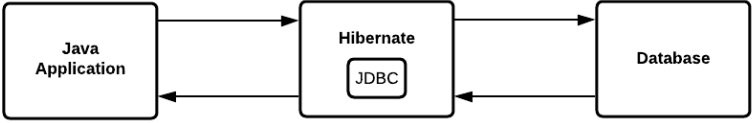
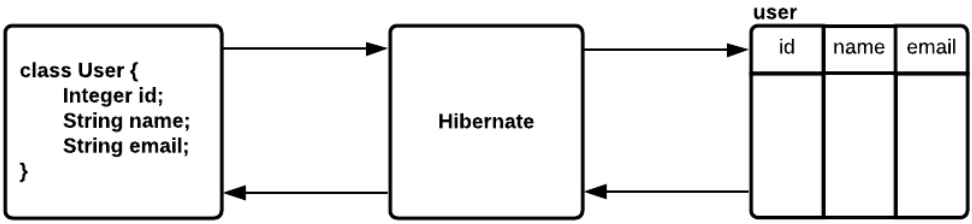
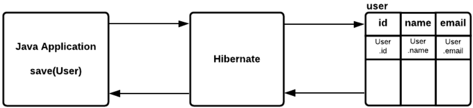
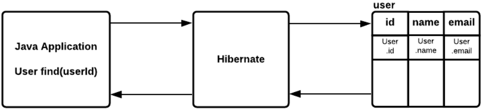
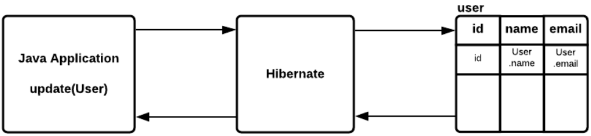
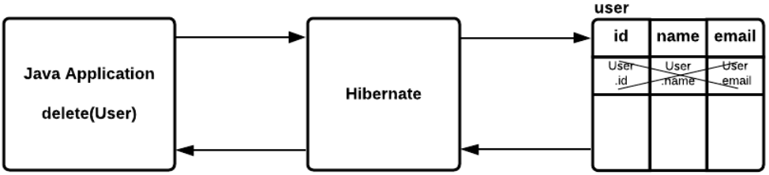

# Spring Data. JPA. Hibernate. Доступ к данным (БД)
До этого для хранения данных использовалась Map, хранение в оперативной памяти, этот способ не подходит при хранении 
больших информаций. Для это используется базы данных. В Spring Boot для этого есть spring-boot-starter-data-jpa.

Для подключения базы данных в Spring Boot приложении необходимо:
* Добавить зависимость spring-boot-starter-data-jpa
* Добавить JDBC драйвер для базы данных
* В application.properties указать url, user, password

## Spring Boot. JPA
JPA (Java Persistence API) - стандартная спецификация, описывающая систему для управления сохранением Java объектов 
в таблицы базы данных.

Hibernate - самая популярная реализация спецификации JPA. Таким образом JPA описывает правила, а Hibernate реализует их.

## Spring Boot. Hibernate
Hibernate - это framework, который используется для сохранения, получения, изменения и удаления Java объектов 
из базы данных.

Hibernate использует JDBC-драйвер для работы с базой данных. Но поверх этого реализован различный вспомогательный 
функционал:
* Реализует технологию ORM;
* Позволяет регулировать SQL запросы;
* Уменьшает количество кода для написания.



### Hibernate. ORM
ORM (Object-to-Relation Mapping) - преобразование Java-объектов в сущность таблицы в БД и обратно. Базово Hibernate 
предоставляет основные CRUD (create, read, update, delete) операции.



### Hibernate. Сохранение сущности
* Сбор данных для полей объекта;
* Написание INSERT команды для добавления новой строки в таблицу с собранными данными

```
INSERT INTO user(id, name, email)
VALUES (User.id, User.name, User.email)
```



### Hibernate. Получение сущности
* Написание SELECT команды для получения необходимых данных;
* Создание Java-объекта и присвоение его полям значений, полученных из БД;

```
SELECT id, name, email
FROM user
WHERE id = :user.id;
```



### Hibernate. Обновление сущности
* Сбор данных для полей объекта;
* Написание UPDATE команды для обновления необходимых данных;

```
UPDATE user
SET name = user.name, email = user.email
WHERE id = :user.id
```



### Hibernate. Удаление сущности
* Сбор данных для полей объекта;
* Написание UPDATE команды для удаления необходимых данных;

```
DELETE FROM user
WHERE id = :user.id
```



### Spring Boot. Подключение к БД

После подключения приложения к БД, в логах добавляется `com.zaxxer.hikari.HikariDataSource: HikariPool-1 - Starting...`. 
**HikariPool** - Connection Pool до нашей БД. При обращении к БД если бы мы писали на JDBC, то каждый раз создавали бы 
новое подключение и открывали новый connect, а HikariPool позволяет создать некий пул подключений, при необходимости 
обращения к БД мы обращаемся сначала к Connection Pool получаем какой-то connection, используем его и возвращаем обратно 
в пул.

Далее по логам видим что загружается Hibernate ORM `org.hibernate.Version: HHH000412: Hibernate ORM core version 5.6.9.Final`, 
далее какой диалект используется `org.hibernate.dialect.Dialect: HHH000400: Using dialect: org.hibernate.dialect.PostgreSQL10Dialect`.

Property `spring.jpa.show-sql=true` позволяет видеть в логах какие sql-запросы генерирует Hibernate.

### Hibernate. Entity
**Entity** - это Java-класс, который отображает информацию определенной таблицы в базе данных. Точнее это POJO-класс, 
в котором мы используем определённые Hibernate аннотации для связи класса с таблицей из базы.

**@Entity** - аннотация, говорит нам о том, что класс имеет отображение в базе данных.

**@Table** - аннотация говорит нам, к какой именно таблицу привязан класс.

**@Column** - аннотация, говорит нам, к какому именно столбцу из таблицы привязано поле класса.

## Hibernate. Id

Для указания поля идентификатора (ключа) используется аннотация `@Id`.

Аннотация `@GenerateValue` описывает стратегию генерации значений для столбца с идентификатором.
* **AUTO** - дефолтный тип, бедут зависеть от БД;
* **IDENTITY** - автоматическое увеличение столбца по правилам, прописанным в БД;
* **SEQUENCE** - увеличение идентификатора с помощью sequence, описанного в БД.