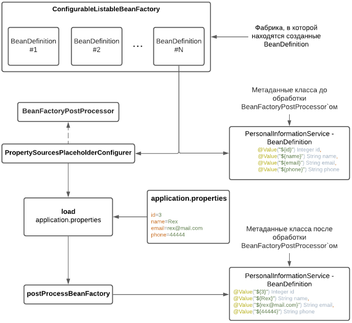
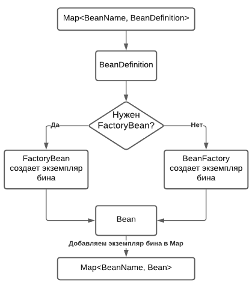
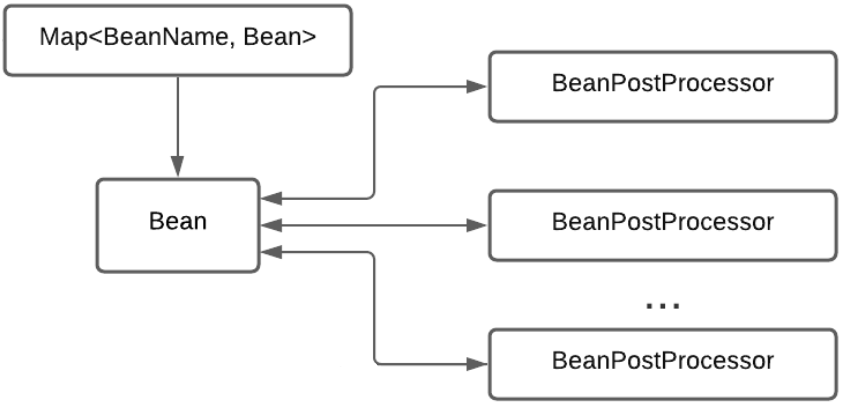
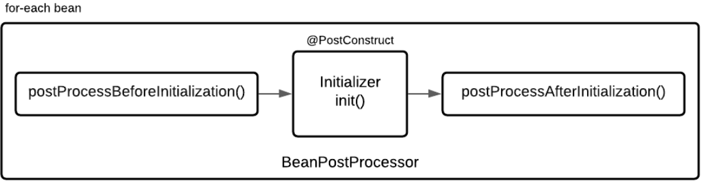

**Spring Framework** - контейнер внедрения зависимостей с несколькими удобными слоями (доступ к базе данных, прокси, аспектно-ориентированное программирование, RPC, веб-инфраструктура MVC, Cloud Native интеграции). Это все позволяет быстрее и удобнее создавать Java-приложения.

**IOC** - Инверсия управления - делегирование  части наших обязанностей внешнему компоненту (Spring Framework). Один из принципов, приближающий наш код к слабосвязанности.

**DI** - Внедрение зависимостей, реализация _IOC_ делает объекты приложения слабосвязанными друг от друга. То есть при инициализации объектов будет заботиться внешний механизм. Работа идет не на уровне классов, а на уровне интерфейсов. Таким образом зависимости между объектами будут сведены к минимуму.

**ApplicationContext** - механизм, который занимается созданием, настройкой и инициализацией объектов. По сути само приложение Spring.

**Bean** - самый обычный объект, который управляется Spring - сервисы, контроллеры, репозитории и т.д.

##Этапы формирования Application Context (жизненный цикл бинов)


### 1. Чтение конфигурации и создание всех BeanDefinition
**BeanDefinition** - метаданные, зарегистрированных в Application Context компонентов, интерфейс который описывает бин, его свойства, аргументы конструктора, и другую метаинформацию.

Способы конфигурирования бинов в Spring:

- _Xml конфиг_ - `ClassPathXmlApplicationContext("context.xml")`;
- _Groovy конфиг_ - `GenericGroovyApplicationContext("context.groovy")`;
- _Package конфиг_ - конфигурация через аннотации с указанием пакета для сканирования - `AnnotationConfigApplicationContext("package.name")`;
- _Java конфиг_ - конфигурация через аннотации с указанием класса, или массива классов, помеченного аннотацией `@Configuration` - `AnnotationConfigApplicationContext(JavaConfig.class)`.

Бины хранятся в виде _HashMap_, где _ключ_ - наименование бина, _значение_ - возвращаемый объект. Отсюда следует, что 2 бина не могут одинаково называться (можно задать иное имя бина).

### 2. Настройка созданных BeanDefinition (интерфейс BeanFactoryPostProcessor)
После 1го этапа у нас имеется _Map_, в которой хранятся созданные _BeanDefinition_. У нас есть возможность повлиять на то какими будут наши бины еще до их фактического создания (имеем доступ к метаданным класса). Для этого существует интерфейс _BeanFactoryPostProcessor_, реализовав который мы получим доступ к созданным _BeanDefinition_ и можем их изменять. В этом интерфейсе всего 1 метод:
```java
public interface BeanFactoryPostProcessor {
    void postProcessBeanFactory(ConfigurableListableBeanFactory var1) throws BeansException;
}
```



Например `@Value`. У нас есть _PropertySourcesPlaceholderConfigurer_, который получает _BeanDefinition_, загружает наш property-файл и в постпроцессе заменяет placeholder на значение из конфигурации (не присваивает переменной)

### 3. Создание кастомных FactoryBean (интерфейс FactoryBean<T>)
_FactoryBean_ - generic-интерфейс которому можно делегировать процесс создания бинов типа `<T>`. Применяется при конфигурировании через xml, для JavaConfig данный интерфейс не используется.

### 4. Создание экземпляров бинов BeanFactory
Созданием экземпляров бинов занимается _BeanFactory_. При этом, если нужно, делегирует это кастомным _FactoryBean_. Экземпляры бинов создаются на основе ранее созданных BeanDefinition.



### 5. Настройка созданных бинов (интерфейс BeanPostProcessor)


Интерфейс _BeanPostProcessor_ позволяет вклиниться в процесс настройки бинов до того как они попадут в контейнер. Интерфейс несет в себе несколько методов:
```java
public interface BeanPostProcessor {
    @Nullable
    default Object postProcessBeforeInitialization(Object bean, String beanName) throws BeansException {
        return bean;
    }

    @Nullable
    default Object postProcessAfterInitialization(Object bean, String beanName) throws BeansException {
        return bean;
    }
}
```


**@PostConstruct** - это `init()` метод, на котором бин еще не до конца сконфигурирован и поэтому если у бина есть какие-то proxy, аспекты, которые для него что-то делают, то этого на данном этапе не существует. Поэтому не желательно использовать `@PostConstruct` для вызова бизнес логики. В данном методе выполняется логика бина, которая предполагалась в конструкторе, потому что при вызове конструктора наш бин еще не настроен, т.к. он(конструктор) вызывается на этапе создания экземпляров бинов _BeanFactory_, а там бин еще не настроен.

**@PreDestroy** - это `destroy()` метод который выполняется при закрытии контекста. Его используют для закрытия соединений с ресурсами.

#### Правила написания BeanPostProcessor
1. Если _BeanPostProcessor_ настраивает объект - пишите логику в `postProcessBeforeInitialization()`
2. Затем выполняется метод `init()`
3. Если _BeanPostProcessor_ меняет поведение методов бина (аспекты, транзакции и т.д. - бизнес логика) путем создания прокси - пишите логику в `postProcessAfterInitialization()`
4. Если мы попытаемся искать аннотацию `@PostConstruct` после того, как сделали прокси, то мы ее не найдем, потому что в прокси ее не будет. Поэтому рекомендуют писать логику в `postProcessBeforeInitialization()`
5. Все методы _BeanPostProcessor_ должны возвращать `Object bean`.

#### Bean scope. Область видимости бина
Аннотация `@Scope` определяет, сколько экземпляров бина создаст Spring.
- **Scope("singleton")** - бин будет синглтоном, т.е. будет только 1 экземпляр бина
- **Scope("prototype")** - каждый раз, когда кому-то нужна ссылка на компонент, Spring создает новый. Если в бин-синглтон заинжектить бин-прототип, то будет создан только 1 экземпляр заинжекченного бина 
- **Scope("session")** - для каждого сеанса HTTP-пользователя будет создан 1 экземпляр бина 
- **Scope("request")** - создается для каждого HTTP-request и уничтожается после завершения обработки

#### Аннотация Lazy
По-умолчанию все бины создаются при запуске Spring-приложения. Это можно изменить, если пометить бин и места где он применяется аннотацией @Lazy. Тогда он не создастся пока не будет явно запрошен из контекста. При условии, что на него не ссылаются другие не-Lazy бины, в этом случае он все равно будет создан.

#### Проксирование Spring
Есть 2 основных инструмента которыми проксируются наши бины:
1. DynamicProxy
2. CGLib

Spring, если нужно сделать прокси на объект, сначала смотрит на его интерфейсы и если они есть, то используется _DynamicProxy_, который создает прокси именно на интерфейс, реализуемый нашим бин-классом. А если интерфейсов нет, то создается при помощи _CGLib_. Предпочтения должны отдавать _DynamicProxy_. Это происходит на этапе создания бинов, и когда начинается внедрение зависимостей, то будет внедрен этот самый прокси-объект, и все обращения будут производиться к этому прокси-объекту.
