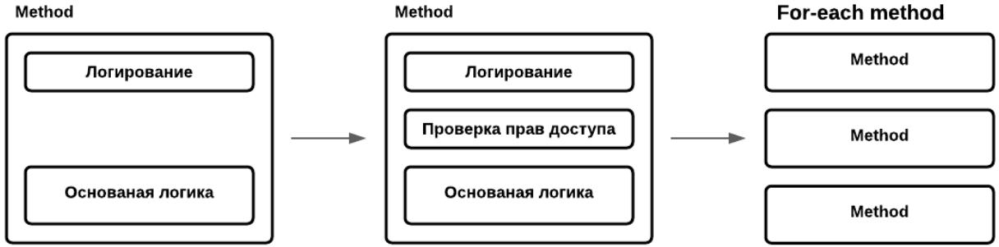
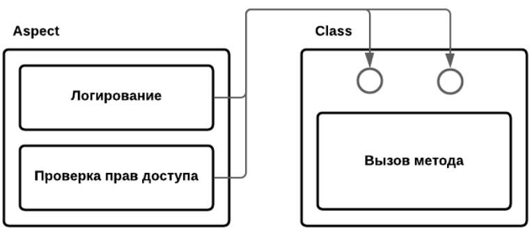
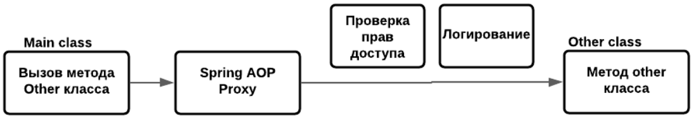
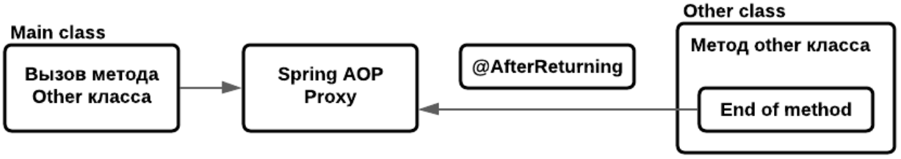
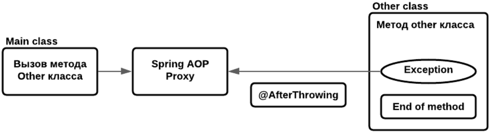
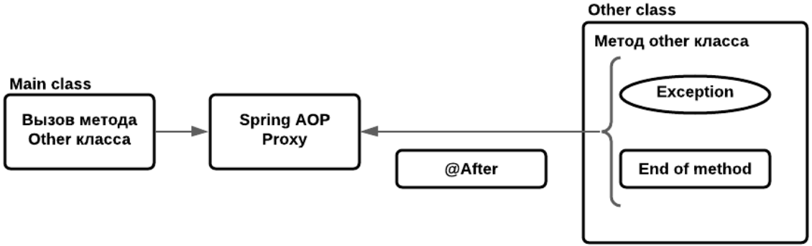
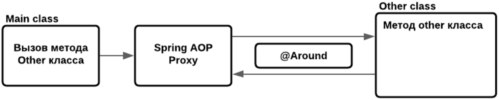

# Spring AOP. Аспектно-ориентированное программирование
## Аспектно-ориентированное программирование



Например, у нас есть метод с основной логикой и теперь перед вызовом метода надо его логировать, потом например надо 
проверять права доступа (не всем пользователям давать вызывать наш метод), потом надо будет добавить во все методы... 
На помощь приходит АОП. 

Проблемы, которые решает АОП:
- Переплетение основной (бизнес) логики со служебным функционалом (code tangling). Метод становится громоздким 
и его основной функционал не сразу заметно.
- Разбросанность служебного функционала по всему проекту (code scattering). При необходимости что-то изменить 
в служебном функционале, мы должны будем делать эти изменения во всех классах.

АОП - парадигма программирования, основанная на идее разделения основного и служебного функционала. 
Служебный функционал записывается в Aspect-классах.

## АОП. Сквозная логика

В основе Aspect заключена сквозная логика (cross-cutting logic).
<p style="text-align: center;"><b>Сквозная логика == Служебный функционал</b></p>

К Сквозной логике АОП относится:
+ Логирование
+ Проверка прав доступа (security check)
+ Обработка транзакций
+ Обработка исключений
+ Кэширование
+ и т.п.



У нас есть какой-то класс, который описывает какую логику надо выполнить (логирование, проверка прав доступа), и она 
встраивается перед вызовом метода. 



У нас есть какой-то класс (Main), который вызывает метод другого (Other) класса. Spring AOP создает Proxy перед нашим 
классом, выполняет проверки которые мы описали в Aspect-классе, после этого происходит вызов метода Other-класса.

## АОП. Плюсы и минусы

**Плюсы:**
+ Сквозной функционал сосредоточен в одном или нескольких общих aspect-классах. Это позволяет легче его менять.
+ Легче добавлять новый сквозной функционал для основного кода или имеющийся сквозной функционал для новых классов. 
Это достигается благодаря конфигурации аспектов.
+ Основной (бизнес) код приложения избавляется от сквозного кода, становится меньше и чище. Работать с ним становится легче.

**Минусы:**
+ Дополнительное время на работу аспектов. Т.к. аспект это такой же прокси то на его создание и настройку требуется какое-то время.

## АОП. Frameworks

**Spring AOP:** 
+ По умолчанию поддерживается Spring.
+ Предоставляет самую распространенную и необходимую функциональность АОП.
+ Простой в использовании.

**AspectJ**
+ АОП расширение языка Java.
+ Предоставляет всю функциональность АОП.
+ Более сложный в использовании.

## АОП. Аннотации

**@EnableAspectJAutoProxy** - включает возможность использования Spring AOP Proxy.

**@Aspect** - говорит о том, что это Aspect-класс. Spring будет его обрабатывать по другому. Относится к библиотеке AspectJ

**Aspect** - это класс, отвечающий за сквозную функциональность.

Хоть Spring изначально поддерживает аспекты и имеет `@EnableAspectJAutoProxy`, но он не имеет `@Aspect`, который нужно 
добавить:
```xml
<dependency>
    <groupId>org.aspectj</groupId>
    <artifactId>aspectjweaver</artifactId>
</dependency>
```

## АОП. Advice типы

+ **Before** - выполняется до вызова основной логики
+ **After Returning** - выполняется только после корректного окончания метода с основной логикой
+ **After throwing** - выполняется после окончания метода с основной логикой только, если было выброшено исключение
+ **After / After finally** - выполняется после окончания метода с основной логикой (в любом случае)
+ **Around** - выполняется до и после метода с основной логикой (в любом случае)

## АОП. Pointcut

**Pointcut** - выражение, описывающее где должен быть применен _Advice_.

_Spring AOP_ использует _AspectJ Pointcut expression language_, т.е. определенные правила в написании выражений 
для создания Pointcut.

## АОП. Pointcut-designator

+ **execution** - основное обозначение pointcut, соответствует точкам соединения выполнения метода, т.е. мы указываем 
сами метода перед (или после) должна выполниться логика advice

`execution(modifiers-pattern? return-type-pattern declaring-type-pattern? method-name-pattern(parameters-pattern) throw-pattern?)`

_modifiers-pattern_ - модификатор доступа (public/private/...). Необязательный (тогда будет применен ко всем).

_return-type-pattern_ - указывает какой тип возвращает наш метод.

_declaring-type-pattern_ - показывает для какого класса мы хотим декларировать наш Advice 
(например `ru.iteco.teachbase.springjunior.account.aop.ExternalServiceImpl.`). Необязательный.

_method-name-pattern_ - имя метода/методов, которые должны подходить под наш аспект. Например `getInfo()` или `get*()`

_parameters-pattern_ - паттерн параметров метода. `..` - неважно какое количество элементов (от 0 и больше), 
можем комбинировать `Long, ..` - для всех методов, у которых 1й аргумент Long и возможно есть еще параметры.

_throw-pattern_ - какие исключения указанны в сигнатуре метода будет выполняться наш аспект. Необязательный.

+ **@annotation** - соответствует точкам соединения, где объект имеет данную аннотацию `@annotation(annotation-type)`

`@Before("@annotation(ru.iteco.teachbase.springjunior.account.aop.aspect.AspectEvent)")`

+ **within** - ограничивает сопоставление точками соединения определенных типов (классов) `within(type-pattern)`

`@Before("within(ru.iteco.teachbase.springjunior.account.aop.repository.*)")`

+ **this** и **target** - сопоставление точками соединения, где _target_ является экземпляром данного типа, 
в то время как _this_ ограничивает сопоставление точками соединения, где _target_ является экземпляром данного типа.
```
public class FooBar implements BarDao {
    ...
}
```
`@Before("target(com.baeldung.pointcutadvice.dao.BarDao)")` - если FooDao реализует BarDao

`@Before("this(com.baeldung.pointcutadvice.dao.FooDao)")` - если FooDao не реализует какой-либо интерфейс

## АОП. Комбинация pointcut-designator

Pointcut-designator можно комбинировать с помощью операторов `&&`, `||` и `!`

```
@Pointcut("@target(org.springframework.stereotype.Repository)")
public void repositoryMethods() {}

@Pointcut("execution(* *..create*(Long,..))")
public void firstLongParamMethods() {}

@Pointcut("repositoryMethods() && firstLongParamMethods()")
public void entityCreationMethods() {}
```

_Pointcut_ регистрируются в репозитории и далее можно обращаться по названию метода pointcut. Мы можем написать 
их где-то отдельно (PointcutRepository) и использовать их в аспектах, комбинировать как-то.

## АОП. Порядок выполнения Aspect

Если при вызове метода с основной логикой срабатывает несколько Advice, то нет никакой гарантии в порядке выполнения
этих Advice. Для соблюдения порядка, такие Advice нужно распределить по отдельным упорядоченным Aspect классам.

Регулировать очередность выполнения аспектов можно через Spring-аннотацию `@Order(...)`. Чем меньше число, тем выше 
приоритет.

## АОП. JoinPoint

**Join Point** - это точка в выполняемой программе когда следует применять Advice. Т.е. это точка переплетения метода 
с бизнес-логикой и метода со служебным функционалом.

Прописав Join Point в параметре Advice-метода, мы получаем доступ к метаданным метода с бизнес-логикой (сигнатуры, 
аргументы).

```
@Before("myPointcut()")
public void methodAdvice(JoinPoint joinPoint) {
    joinPoint.getArgs();
}
```

Его методы:
+ **getArgs()** - возвращает аргументы вызываемого метода, если их нет, то вернется пустой массив;
+ **getStaticPart()** - статический набор методов, нужен для ускорения работы advice, т.е. если мы понимаем что из joinPoint
нам хватит сигнатуры (не нужны аргументы метода, которые меняются в runtime), то можем написать в advice 
`JoinPoint.StaticPart` - вложенный интерфейс который содержит в себе только статическую информацию, определяемую на этапе
инициализации контекста, за счет этого работает быстрее;
+ **toString()** - вернет информацию по _JoinPoint_ в формате `String`;
+ **getKind()** - этап, на котором вызван наш _Advice_;
+ **getSignature()** - сигнатура нашего метода, имя, доступ, возвращаемый результат;
+ **getThis()** - объект, на котором вызван метод;
+ **toLongString()** - полное описание _JoinPoint_;
+ **toShortString()** - короткое описание _JoinPoint_.

## АОП. After returning



Выполняется только после **корректного** окончания метода с основной логикой.

```
@AfterReturning(value = "allGetMethod()", returning = "result")
public void afterAllGetMethodAdvice(JoinPoint joinPoint, Object result) {...}
```
где _value_ - Pointcut-designator, _returning_ - имя возвращаемого выполненным методом объекта.
**ВАЖНО!** Результат работы в данном Advice менять не стоит, для этого используется другой Advice.

## АОП. After throwing



Выполняется после окончания метода с основной логикой только, если было выброшено исключение.
```
@AfterThrowing(value = "allSaveMethod()", throwing = "exception")
public void afterSaveMethodThrowAdvice(JoinPoint joinPoint, Exception exception) {...}
```
Как и с `@AfterReturning` в данном Advice не желательно менять Exception, есть другой метод. Нужен для информатирования,
проверок и иных подобных(не модифицирующих) действий.

## АОП. After / After Finally



В любом случае выполняется после окончания метода с основной логикой.
```
@After("allSaveMethod() || allGetMethod()")
public void afterSaveAndGetMethodAdvice(JoinPoint joinPoint) {...}
```

## АОП. Around



Выполняется до и после метода с основной логикой.

Возможности **@Around**:
+ Произвести действия до работы основного (target) метода;
+ Произвести действия после работы основного метода;
+ Получить результат работы основного метода и изменить его;
+ Произвести действия, если из основного метода выбрасывается исключения (вернуть другой результат);
+ Не вызывать метод, если какие-то условия не выполнены;
+ и т.д.

```
@Around(value = "allGetMethodWithUser(user)", argNames = "proceedingJoinPoint,user")
public Object aroundAllGetMethodCheckAdvice(ProceedingJoinPoint proceedingJoinPoint, User user) throws Throwable {...}
```
`proceedingJoinPoint.proceed()` - запуск основного метода.
`proceedingJoinPoint.proceed(Object[] args)` - запуск основного метода с заменой аргументов нашего метода 
(`joinPoint.getArgs()`) с бизнес-логикой. В этом случае количество аргументов должно совпадать с основным методом.

