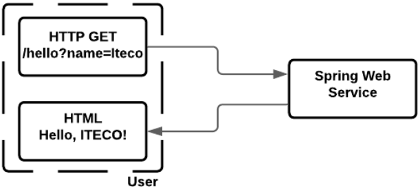
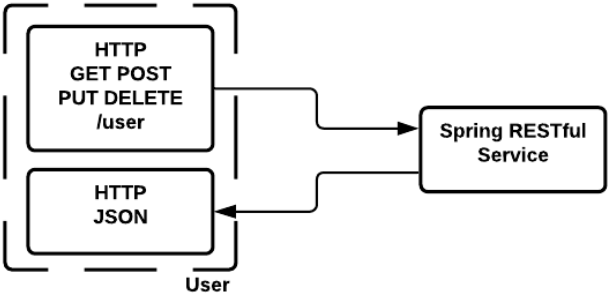
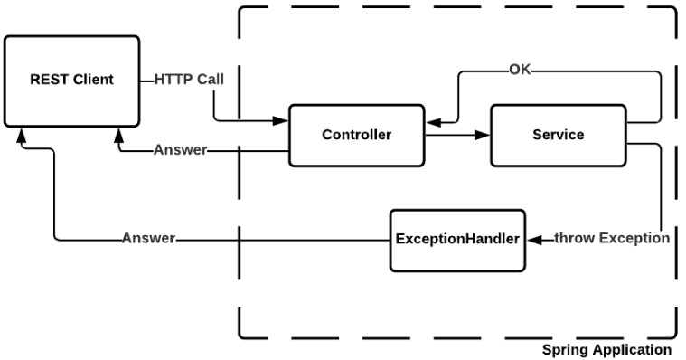

# Spring Boot
**Spring Boot** - полезный проект, целью которого является упращение создания приложений на основе Spring. Он позволяет
наиболее простым способом создать web-приложение, требуя от разработчиков минимум усилий по его настройке и написанию 
кода.

Spring Boot обладает большим функционалом, но его наиболее значимыми особенностями являются: управление зависимостями,
автоматическая конфигурация и встроенные контейнеры сервлетов.

## Spring Boot. Управление зависимостями
Spring Boot неявно упаковывает необходимые сторонние зависимости для каждого типа приложения Spring и предоставляет их 
разработчику посредством так называемых spring-boot-starter-пакетов.

**Starter-пакеты** - это набор удобных дескрипторов зависимостей, которые можно включить в свое приложение. Это позволит
получить универсальное решение для всех, связанных со Spring технологий, избавляя программиста от лишнего поиска
примеров кода и загрузки их них требуемых дескрипторов зависимостей.

Например:
+ spring-boot-starter-web
+ spring-boot-starter-data-jpa

## Spring Boot. Автоматическая конфигурация
После выбора подходящего starter-пакета, Spring Boot попытается автоматически настроить Spring-приложение на основе 
добавленных jar-зависимостей.

Например, если добавите spring-boot-starter-web, то Spring Boot автоматически сконфигурирует бины (Dispatcher Servlet
(отвечает за обработку обращений к вашему web-сервису), ResourceHandlers, MessageSource). Если вы используете 
spring-boot-starter-jdbc, то Spring Boot автоматически регистрирует бины DataSource (подключение к БД), 
EntityManagerFactory (менеджер который отвечает за представление наших объектов из БД), 
TransactionManager (менеджер, который отвечает за транзакции) и считывает информацию для подключения к базе данных 
из файла application.properties (вся эта информация определена какими-то переменными, они стандартные, вы указываете 
3 поля (url, user, password) - подключение настроено). Это автоматическая конфигурация помогает благодаря тому,
что не приходится все настраивать вручную. 

Автоматическая конфигурация может быть переопределена с помощью пользовательских настроек.

## Spring Boot. Встроенная поддержка сервера приложений (контейнера сервлетов)
Каждое Spring Boot web-приложение включает встроенный web-сервер. Поддерживаемый "из коробки": Tomcat.

Если вам нужно использовать другой HTTP-сервер, для этого достаточно исключить зависимости по-умолчанию. Spring Boot
предоставляет отдельные starter-пакеты для разных HTTP-серверов. 

Разработчикам теперь не надо беспокоиться о настройке контейнера сервлетов и развертывании приложения на нем. Теперь 
приложение может запускаться само, как исполняемый jar-файл с использованием встроенного сервера. Значительно упрощает
установку и развертывание приложений.

## Spring Boot. Servlet

Сервлет - обработчик запросов на сервер
+ **spring-boot-sterter-tomcat** - дефолтный
+ **spring-boot-sterter-jetty** - альтернатива Tomcat
+ **spring-boot-sterter-undertow** - альтернатива Tomcat
+ **spring-boot-sterter-reactor-netty** - для использования Reactor Netty в качестве встроенного reactive HTTP сервера

Изменить дефолтный сервер:
```xml
<?xml version="1.0" encoding="UTF-8" ?>
<dependensies>
    <dependency>
        <groupId>org.springframework.boot</groupId>
        <artifactId>spring-boot-starter-web</artifactId>
        <exclusions>
            <exclusion>
                <groupId>org.springframework.boot</groupId>
                <artifactId>spring-boot-starter-tomcat</artifactId>
            </exclusion>
        </exclusions>
    </dependency>

    <dependency>
        <groupId>org.springframework.boot</groupId>
        <artifactId>spring-boot-starter-jetty</artifactId>
    </dependency>
</dependensies>
```
Весь Spring Web реализован поверх Servlet Api который построен вокруг 2 объектов:
+ запросы от клиента, который оборачивается в HTTP-Servlet-request
+ ответ формируется из заполненного нашим кодом который мы выполняем на сервере http-servlet-responce

Имея доступ к этим объектам вы получаете полный контроль над всей http-сессией. **spring-boot-starter-web** позволяет 
обращаться к ним напрямую.

## Spring Boot. Создание приложения
Необходимо настроить Spring Boot в файле pom.xml

Все приложения Spring Boot конфигурируются от spring-boot-starter-parent, поэтому для дальнейшего определения 
зависимостей, необходимо добавить starter-parent следующим образом:
```xml
<parent>
    <groupId>org.springframework.boot</groupId>
    <artifactId>spring-boot-starter-parent</artifactId>
    <version>версия spring boot</version>
</parent>
```
Также добавляем Spring Boot plugin для Maven:
```xml
<build>
    <plugins>
        <plugin>
            <groupId>org.springframework.boot</groupId>
            <artifactId>spring-boot-maven-plugin</artifactId>
        </plugin>
    </plugins>
</build>
```

## Spring Boot. @SpringBootApplication
**@SpringBootApplication** комбинирует в себе 3 аннотации Spring:
+ **@Configuration**
+ **@EnableAutoConfiguration** - конфигурация приложения будет выполняться с помощью Spring Boot
+ **@ComponentScan** - откуда сканировать пакеты на наличие декларированных бинов, по-умолчанию текущий пакет + подпакеты

`SpringApplication.run(SpringJuniorApplication.class, args);` - в методе находится запуск нашего application context, 
обработка жизненного цикла, при завершении приложения - запуск метода close(), удаление всех бинов, выполнение 
destroy-методов и т.д.

## Spring Boot. Основные starter

+ **spring-boot-starter** - core starter, включающий поддержку автоконфигурации, логирование и YAML;
+ **spring-boot-starter-test** - тестирование Spring Boot приложений с библиотеками JUnit, Hamcrest и Mockito;
+ **spring-boot-starter-web** - создание web-приложений (включая RESTful), используя Spring MVC. Использует Tomcat 
как встроенный контейнер по-умолчанию;
+ **spring-boot-starter-date-jpa/jdbc** - стартер для использования БД с Hibernate;
+ **spring-boot-starter-security** - стартер для использования Spring Security;
+ **spring-boot-starter-cloud-*** - набор стартеров для разработки в Cloud. 

Стартеров очень много, можно найти на странице spring boot

## Spring Boot. Starter web

Если необходимо создать какое-то web-приложение(или RESTful) то наш выбор - Spring Boot Starter Web

```xml
<dependency>
    <groupId>org.springframework.boot</groupId>
    <artifactId>spring-boot-starter-web</artifactId>
</dependency>
```
Определяет зависимости:
+ **Spring**: core, beans, context, aop
+ **Web MVC**: Spring MVC
+ **Jackson**: для работы с JSON
+ **Валидация**: Hibernate Validator, Validation API
+ **Embedded** Servlet Container: Tomcat
+ **Логгирование**: logback, slf4j

## Spring Boot. Spring MVC
**Spring MVC** - фреймворк для создания веб-приложений на Java в основе которого лежит шаблон проектирования 
MVC(model-view-controller).

**Model** - компонент, отвечающий за данные приложения и работу с этими данными, т.е. помогает взаимодействовать 
приложению с какими-то внешними данными;

**View** - компонент, отвечающий за взаимодействие с пользователем. Определяет внешний вид приложения;

**Controller** - компонент, отвечающий за связь между Model и View. Здесь сосредоточена логика работы приложения 
(бизнес-логика)

### Spring MVC. Dispatcher Servlet
Вся логика работы Spring MVC построена вокруг Dispatcher Servlet, который принимает и обрабатывает все http-запросы 
и ответы на них.

Рабочий процесс обработки запросов Dispatcher Servlet:


1) Наш HTTP-запрос приходит в Dispatcher Servlet
2) Dispatcher Servlet обращается к интерфейсу Handler Mapping, который определяет какой контроллер должен быть вызван
3) Dispatcher Servlet отправляет запрос в нужный контроллер (из предыдущего шага). Контроллер принимает запрос и 
вызывает соответствующий метод. Вызванный метод определяет модели, основанные на определенной бизнес-логике и возвращает 
в Dispatcher Servlet имя нашего представления
4) Dispatcher Servlet передает управление View Resolver, который определяет какое представление нам необходимо предоставить
5) Dispetcher Servlet отправляет данные модели в виде атрибутов в наше представление, которое возвращается как ответ(HTTP Response)

Он будет обрабатывать входящие данные которые имеет в параметрах запроса, переводить их в объекты java и перенаправлять 
в класс-контроллер, далее контроллер будет выполнять какие-то действия и возвращать наименование нашего представления и
заполнять какую-то модель для нашего представления.

### Spring MVC. Пример


Пример контроллера который обрабатывает HTTP-запрос с параметром _name_:
```java
@Controller
public class HelloController {

    @GetMapping("/hello")
    public String hello(@RequestParam(name = "name", required = false, defaultValue = "World") String name, Model model) {
        model.addAttribute("name", name);
        return "hello";
    }
}
```

В параметрах приходит модель, также должны показать контроллеру, что параметр name будет передан в url с помощью аннотации.
Метод должен возвращать имя представления(местоположение шаблона resources/templates)

```html
<!DOCTYPE html>
<html xmlns:th="http://www.thymeleaf.org" lang="en">
<head>
    <meta charset="UTF-8">
    <title>Title</title>
</head>
<body>
<p th:text="'Hello, ' + ${name} + '!'"/>
</body>
</html>
```

Также необходимо определить View Resolve.

Существуют несколько библиотек которые хорошо интегрируются в Spring MVC: Thymeleaf, FreeMaker, Mustag. 
Мы должны явно выбрать библиотеку шаблонов, иначе метод контроллеров не сможет отобразить страницу.
Spring пытается найти ваши html шаблоны, которые возвращает контроллер, класс называется ViewResolver. Если нет 
имплементаций ViewResolver - ничего не заработает.
Со стартером thymeleaf эта настройка происходит автоматически:
```xml
<dependency>
    <groupId>org.springframework.boot</groupId>
    <artifactId>spring-boot-starter-thymeleaf</artifactId>
</dependency>
```

Что мы сделали:
1) У нас имеется аннотация **@Controller**. Класс-контроллер в Spring аннотируется @Controller, ему не нужно 
реализовывать какие-то интерфейсы или расширять другие классы, просто вешаем аннотацию;
2) **@GetMapping** - сообщает в DispatcherServlet, что всякий раз когда приходит запрос GET для url "/hello", включая 
наши любые параметры запроса ("name"), он должен отправлять запрос именно этому методу контроллера. Аналогичен записи
`@RequestMapping(method = RequestMethod.GET,value = "/hello")`;
3) Наименование метода контроллера не имеет значение, однако мы указываем что каждый запрос должен включать параметр 
запроса который должен быть частью url `@RequestParam(name = "name", required = false, defaultValue = "World") String name`;
4) Spring MVC автоматически внедряет параметр **Model** в метод контроллера. Model представляет собой простой _Map_, 
куда нужно поместить все данные, которые мы хотим использовать в наших templates `model.addAttribute("name", name);`;
5) Далее идет бизнес логика (заполнение model параметром name);
6) Возвращаем наименование шаблона.

В результате наш запрос `GET http://localhost:8080/hello?name=iteco` вернет страницу с текстом `Hello, iteco!`

### Spring MVC. Резюме

+ С помощью нескольких аннотаций (`@Controller`, `@RequestMapping`, `@RequestParam`) можно написать контроллер, который будет 
заботиться о получении данных запроса и обрабатывать их соответствующим образом.
+ Модель содержит все данные, которые необходимо отобразить в своем представлении. Это ваша работа - заполнить модель.
+ Представление - просто шаблон. Неважно, откуда взяты данные (модели), каков текущий HTTP-запрос или есть активный 
HTTP-сеанс или нет.

**Один из важных аспектов MVC**: "Разделение ответственности - каждый отвечают за свою часть (за данные отвечает model,
за шаблоны и представлениями - view, за передачу view - controller)"

## Spring Boot. Spring Web
###Spring Web. Rest controller

**@RestController** ставится на класс-контроллер вместо _@Controller_. Отличие в том, что @Controller работает с нашими 
представлениями (view), а @RestController работает именно с объектами (model).

Она состоит из аннотаций _@Controller_ и _@ResponceBody_. 
Аннотация **@ResponceBody** ставится на методы, которые работают с данными, а не с моделями. Ее не требуется указывать 
явно, если используется _@RestController_.

Обычные методы возвращают _Model_, а методы аннотированные **@ResponseBody** возвращают объекты, которые конвертируются 
в медиа-файлы с помощью **HttpMessageConverter**.



Если наш метод корректно заканчивает работу, т.е. при работе наших методов не возникает никаких исключений и метод 
контроллера корректно заканчивает работу, то наш результат возвращается с HTTP-code 200(корректно завершение). 
Если мы хотим при создании возвращать другой код, это можно переопределить:
1) возвращать **ResponseEntity**, который содержит дополнительную информацию по результату работы метода;
2) поставить над методом контроллера **@ResponseStatus**.

Как происходит преобразование? Конвертация запросов и ответов происходит с помощью HttpMessageConverters, 
в Spring дефолтный - Jackson, он преобразует наши объекты в JSON-файлы. Если мы не указываем Content-type в 
HandlerMapping, то по-умолчанию берется json-формат, можно переопределить с помощью контента, тогда нужны будут 
дополнительно конвертеры.

### Spring Web. Exception Handler


Если мы не обработали исключение и оно вернулось как результат работы контроллер-метода, то оно
заворачивается в стандартный ответ (в дэбаге можно получить stacktrace)
```json
{
  "timestamp": "2022-03-05T13:43:23.091+00:00",
  "status": 500,
  "error": "Internal Server Error",
  "path": "/rest/user/3"
}
```
!!!stacktrace нельзя возвращать!!! Его надо обрабатывать
